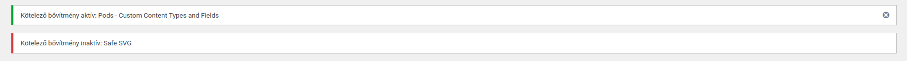

# WordPress Require plugins

A simple WordPress library that can be added to custom themes to display admin notices of theme's plugin dependencies. :electric_plug:

## Description

WordPress Require plugins is a library that allows you to display a notice in the admin dashboard if a required plugin is not installed or activated. You can use this to register plugin dependencies on the theme level, which makes bespoke themes compact and portable.

## Version

1.0.0

## Installation

To use WordPress Require plugins, you need to download it and include it in your theme's `functions.php` file. You can do this by either editing the theme directory directly or using a child theme.

1. Install [JavaScript Cookie](https://github.com/js-cookie/js-cookie) in the theme directory.
`npm install js-cookie`
2. Download WordPress Require plugins, and include `inc/wp-require-plugins.php` in your theme's or child theme's `functions.php` file.
```php
require get_template_directory() . '/inc/wp-require-plugins.php';
```

## Usage

Edit the code in `inc/wp-require-plugins.php` and pass in your theme's plugin dependencies' `name` and `file_path` to the `$required_plugins` array.
```php
$required_plugins = array(
  // Examples
  array(
    // Create key file_path for required plugin
    'file_path' => 'pods/init.php',
    // Create key name for required plugin when inactive
    'name' => 'Pods - Custom Content Types and Fields'
  ),

  array(
    'file_path' => 'safe-svg/safe-svg.php',
    'name' => 'Safe SVG'
  ));
```

To get a list of all plugins in WordPress to find out their names, you can use the following code snippet in a template file:
```php
// Require plugin.php to retrieve an array of installed plugins
require_once(ABSPATH . '/wp-admin/includes/plugin.php');

// Get all plugins
$plugins_all = get_plugins();

// Get active plugins
$plugins_active = get_option('active_plugins');

// Loop through all plugins
foreach ($plugins_all as $plugin_file => $plugin_info) {
  // Check if plugin is active
  if (in_array($plugin_file, $plugins_active)) {
    // If plugin is active, print the name
    echo $plugin_info['Name'] . '<br>';
  }
}
```

Once you have added and configured WordPress Require plugins, you should see notices in the admin dashboard of required plugins' if they're activated or not. The success notices will have a button to dismiss it. Dismissing a notice is saved for 30 days by default.

## Dependencies

WordPress Require plugins requires the following node modules to work properly:

- [JavaScript Cookie](https://github.com/js-cookie/js-cookie)

## Screenshots



A preview of the admin notices' appearance in the admin dashboard.

## Contributing

- If you find any bugs or issues with WordPress Require plugins, please report them on the GitHub issue tracker.
- If you want to contribute to WordPress Require plugins development, please fork the GitHub repository and submit a pull request with your changes.
- If you find WordPress Require plugins useful, please star the GitHub repository.

## License

WordPress Require plugins is licensed under the [Apache 2.0](https://github.com/martonlente/wordpress-require-plugins/blob/main/LICENSE) license.
